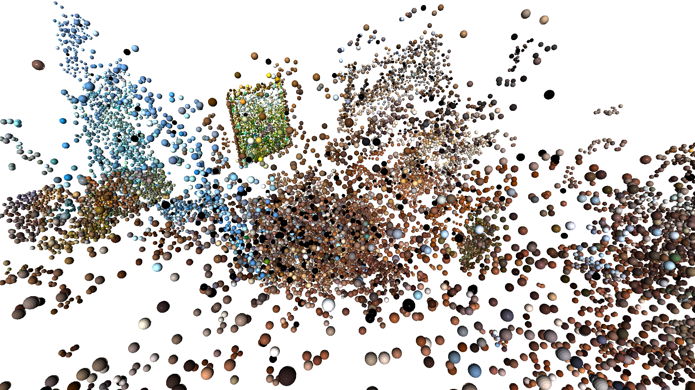

# 3D Gaussian Splatting from Scratch

References
- https://huggingface.co/datasets/DL3DV/DL3DV-Benchmark
- https://github.com/google-research/multinerf/blob/main/scripts/local_colmap_and_resize.sh
- https://colmap.github.io/cli.html#cli
- https://repo-sam.inria.fr/fungraph/3d-gaussian-splatting/


## 1. Download Dataset (DL3DV-Benchmark)

<details>
<summary>Download Dataset</summary>

First try running without --hash to get .csv file.
Then $hash = scene_hash in .csv file

```bash
python utils/download.py --odir data --subset hash --only_level4 --hash $hash
```
</details>

## 2. Run COLMAP

<details>
<summary>Run with docker</summary>

```bash

docker pull colmap/colmap # cuda=12.6
docker pull colmap/colmap:20240723.601 # cuda<=12.4

docker run --gpus all -it -v $(pwd)/data:/data colmap/colmap:20240723.601
```
</details>

<details>
<summary>Run COLMAP in Docker shell</summary>

```bash
USE_GPU=1
# Dataset path that contains images/
DATASET_PATH=/data
CAMERA=${2:-OPENCV} # or OPENCV_FISHEYE

### Feature extraction
colmap feature_extractor \
    --database_path "$DATASET_PATH"/database.db \
    --image_path "$DATASET_PATH"/images \
    --ImageReader.single_camera 1 \
    --ImageReader.camera_model "$CAMERA" \
    --SiftExtraction.use_gpu "$USE_GPU"


### Feature matching
colmap exhaustive_matcher \
    --database_path "$DATASET_PATH"/database.db \
    --SiftMatching.use_gpu "$USE_GPU"

### Bundle adjustment
### takes the longest time
mkdir -p "$DATASET_PATH"/sparse
colmap mapper \
    --database_path "$DATASET_PATH"/database.db \
    --image_path "$DATASET_PATH"/images \
    --output_path "$DATASET_PATH"/sparse \
    --Mapper.ba_global_function_tolerance=0.000001
```
</details>


<details>
<summary>Optional Dense Reconstruction (not necessary for this dataset)</summary>

```bash
colmap image_undistorter \
    --image_path $DATASET_PATH/images \
    --input_path $DATASET_PATH/sparse/0 \
    --output_path $DATASET_PATH/dense \
    --output_type COLMAP \
    --max_image_size 2000

### takes a while
colmap patch_match_stereo \
    --workspace_path $DATASET_PATH/dense \
    --workspace_format COLMAP \
    --PatchMatchStereo.geom_consistency true

### haven't tested
colmap stereo_fusion \
    --workspace_path $DATASET_PATH/dense \
    --workspace_format COLMAP \
    --input_type geometric \
    --output_path $DATASET_PATH/dense/fused.ply

### haven't tested
colmap poisson_mesher \
    --input_path $DATASET_PATH/dense/fused.ply \
    --output_path $DATASET_PATH/dense/meshed-poisson.ply

### haven't tested
colmap delaunay_mesher \
    --input_path $DATASET_PATH/dense \
    --output_path $DATASET_PATH/dense/meshed-delaunay.ply
```

</details>

<details>
<summary>Output format of COLMAP</summary>

### cameras.bin
Contains camera intrinsic parameters for each camera:
| Parameter | Description |
|-----------|-------------|
| Camera ID | Unique identifier for each camera |
| Model Type | Camera model (PINHOLE, SIMPLE_RADIAL, etc.) |
| Dimensions | Image width and height |
| Calibration | Focal length, principal point, distortion coefficients |

### images.bin
Stores camera extrinsic parameters (poses) for each image:
| Parameter | Description |
|-----------|-------------|
| Image ID | Unique identifier for each image |
| Rotation | Camera orientation as quaternion |
| Translation | Camera position vector |
| Camera ID | Reference to corresponding camera in cameras.bin |
| Filename | Name of the source image file |

### points3D.bin
Contains the reconstructed 3D point cloud data:
| Parameter | Description |
|-----------|-------------|
| Point ID | Unique identifier for each 3D point |
| Coordinates | XYZ position in world space |
| Color | RGB color values |
| Error | Reprojection error |
| Track Length | Number of images observing this point |
| Track Info | List of image IDs and feature IDs that observed this point |

</details>

<details>
<summary>Visualize COLMAP output</summary>

### Point Cloud Visualization Script

```python
import numpy as np
from utils.colmap_utils import read_points3D_binary, visualize_point_cloud

points3D_file = "data/sparse/0/points3D.bin"
points3D_data = read_points3D_binary(points3D_file)

points = np.array([v["xyz"] for v in points3D_data.values()])
colors = np.array([v["rgb"] / 255.0 for v in points3D_data.values()])

print(f"Loaded {len(points)} points")

visualize_point_cloud(points, colors)
```

### Open3D Viewer controls

#### Mouse view control
 - Left button + drag         : Rotate.
 - Ctrl + left button + drag  : Translate.
 - Wheel button + drag        : Translate.
 - Shift + left button + drag : Roll.
 - Wheel                      : Zoom in/out.

#### Keyboard view control
 - [/]          : Increase/decrease field of view.
 - R            : Reset view point.
 - Ctrl/Cmd + C : Copy current view status into the clipboard.
 - Ctrl/Cmd + V : Paste view status from clipboard.

#### General control
 - Q, Esc       : Exit window.
 - H            : Print help message.
 - P, PrtScn    : Take a screen capture.
 - D            : Take a depth capture.
 - O            : Take a capture of current rendering settings.
</details>

####
Example COLMAP from dataset's frame_00001.

$dataset_hash=9641a1ed7963ce5ca734cff3e6ccea3dfa8bcb0b0a3ff78f65d32a080de2d71e.

<div style="display: flex; justify-content: space-between;">
    
    
</div>


## 3. Gaussian Splatting Pseudocode

<details>
<summary>Gaussian Splatting Notes</summary>

```
3D Gaussian Splatting (volumetric, rasterization)
1. initialize 3D gaussians
    - differentiable volumetric representation
2. optimize anisotropic covariance
3. visibility-aware rendering algorithm

Allows high quality and real-time rendering

VS Nerfs (ray tracing)
 - high quality but slow training
 - fast training with hash encoding / , but slow rendering
 - importance sampling and positional encoding, but still slow
 - struggle with empty space since neural networks are "continuos"
Inputs:
 - Only use SFM (Colmap)
 - MVS data (dense reconstruction, color, depth, normals, confidence)
    - re-project and blend input images, but fail to recover "unreconstructred or over-reconstructed" regions
    - so new methods leverage GPU that reduce artifacts
 - Initialize 150k gaussians with SFM points. For nerf-synthetic, even randomized points do well

Gaussian points --> project to 2D, then apply alpha blending
  - Like NeRF, trace depth
   - initially tried with points, but there were holes so moved to "splatts" or circular / elliptic discs
    - also, initial methods still depended on MVS

Optimization:
 - 3D position
 - opacity alpha
 - anisotropic covariance
 - spherical harmonic coefficients

- blended with adaptive density control
 - add more gaussians
 - remove gaussians

Real-time rendering:
 - tile-based rasterization GPU sorting
 - alpha blending (visibility-aware). Allows fast forward and backward pass

Alpha blending (like NeRF)
 - samples point along a ray
 - compute density (color) at each point
    - C = T*alpha*(cumulative)
```
</details>


<details>
<summary>Gaussian Splatting Pseudocode (from paper)</summary>

```
Algorithm 1 Optimization and Densification
𝑤, ℎ: width and height of the training images

𝑀 ← SfM Points ⊲ Positions
𝑆,𝐶, 𝐴 ← InitAttributes() ⊲ Covariances, Colors, Opacities
𝑖 ← 0 ⊲ Iteration Count

while not converged do
    𝑉 , ˆ𝐼 ← SampleTrainingView() ⊲ Camera 𝑉 and Image
    𝐼 ← Rasterize(𝑀, 𝑆, 𝐶, 𝐴, 𝑉 ) ⊲ Alg. 2
    𝐿 ← 𝐿𝑜𝑠𝑠(𝐼, ˆ𝐼) ⊲ Loss
    𝑀, 𝑆, 𝐶, 𝐴 ← Adam(∇𝐿) ⊲ Backprop & Step
    if IsRefinementIteration(𝑖) then
        for all Gaussians (𝜇, Σ, 𝑐, 𝛼) in (𝑀, 𝑆,𝐶, 𝐴) do
            if 𝛼 < 𝜖 or IsTooLarge(𝜇, Σ) then ⊲ Pruning
                RemoveGaussian()
        if ∇𝑝𝐿 > 𝜏𝑝 then ⊲ Densification
                if ∥𝑆 ∥ > 𝜏𝑆 then ⊲ Over-reconstruction
                    SplitGaussian(𝜇, Σ, 𝑐, 𝛼)
                else ⊲ Under-reconstruction
                    CloneGaussian(𝜇, Σ, 𝑐, 𝛼)
    𝑖 ← 𝑖 + 1


Algorithm 2 GPU software rasterization of 3D Gaussians
𝑤, ℎ: width and height of the image to rasterize
𝑀, 𝑆: Gaussian means and covariances in world space
𝐶, 𝐴: Gaussian colors and opacities
𝑉 : view configuration of current camera

function Rasterize(𝑤, ℎ, 𝑀, 𝑆, 𝐶, 𝐴, 𝑉 )
    CullGaussian(𝑝, 𝑉 ) ⊲ Frustum Culling
    𝑀′, 𝑆′ ← ScreenspaceGaussians(𝑀, 𝑆, 𝑉 ) ⊲ Transform
    𝑇 ← CreateTiles(𝑤, ℎ)
    𝐿, 𝐾 ← DuplicateWithKeys(𝑀′, 𝑇 ) ⊲ Indices and Keys
        SortByKeys(𝐾, 𝐿) ⊲ Globally Sort
    𝑅 ← IdentifyTileRanges(𝑇 , 𝐾)
    𝐼 ← 0 ⊲ Init Canvas
    for all Tiles 𝑡 in 𝐼 do
        for all Pixels 𝑖 in 𝑡 do
            𝑟 ← GetTileRange(𝑅, 𝑡)
            𝐼 [𝑖] ← BlendInOrder(𝑖, 𝐿, 𝑟, 𝐾, 𝑀′, 𝑆′, 𝐶, 𝐴)
    return 𝐼
```
</details>

## 4. Implementation

1. Initialize 3D gaussian points with covariance matrices
 -  Σ = 𝑅𝑆𝑆^𝑇𝑅^𝑇: factorized with rotation R and scaling S
 -  isotropic Gaussian with axes equal to mean of distance to closest three points


<div style="display: flex; justify-content: space-between;">
    
</div>
